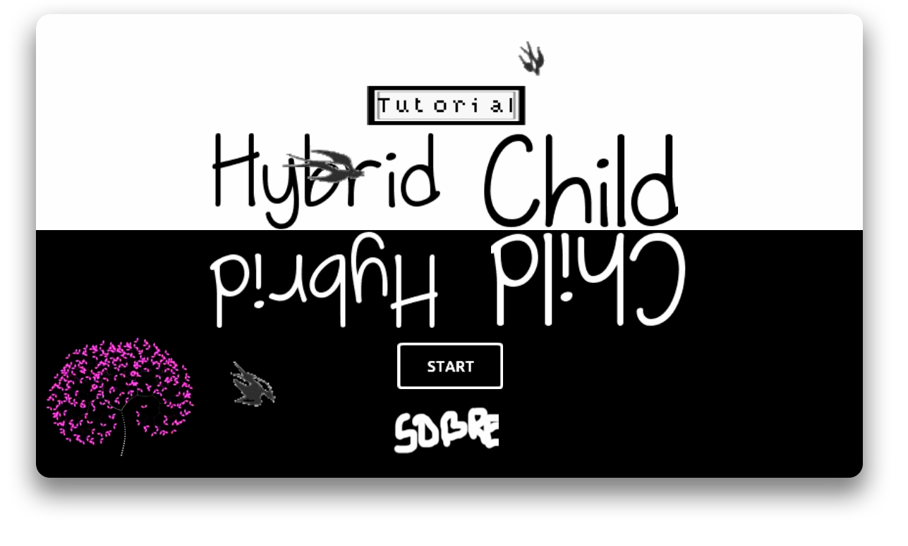
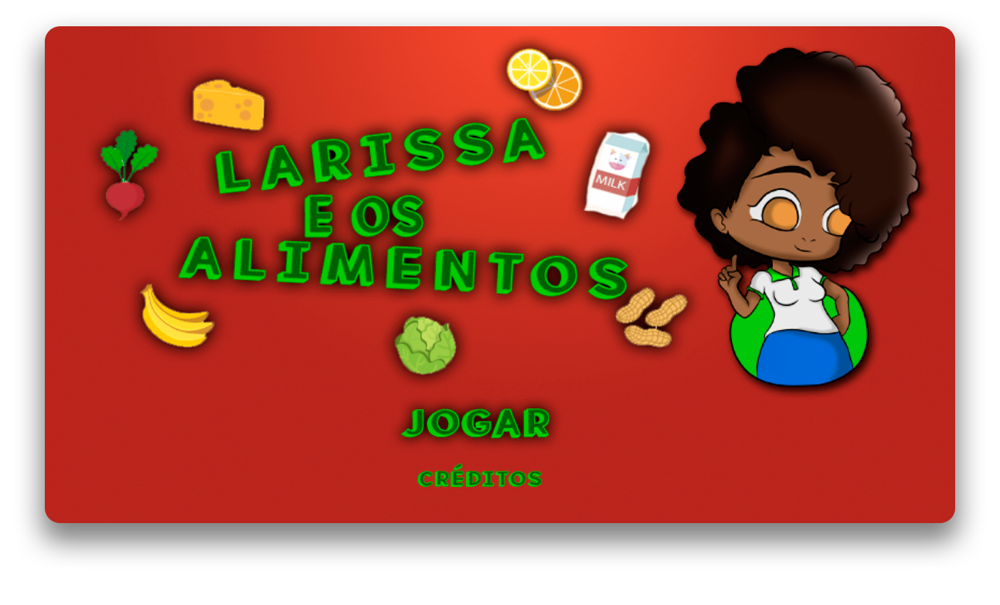
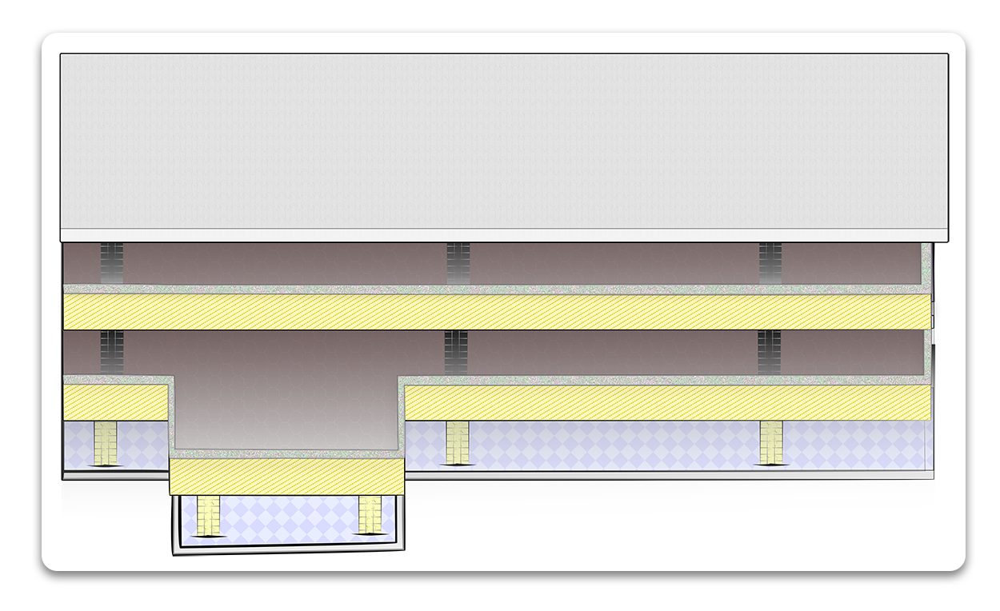
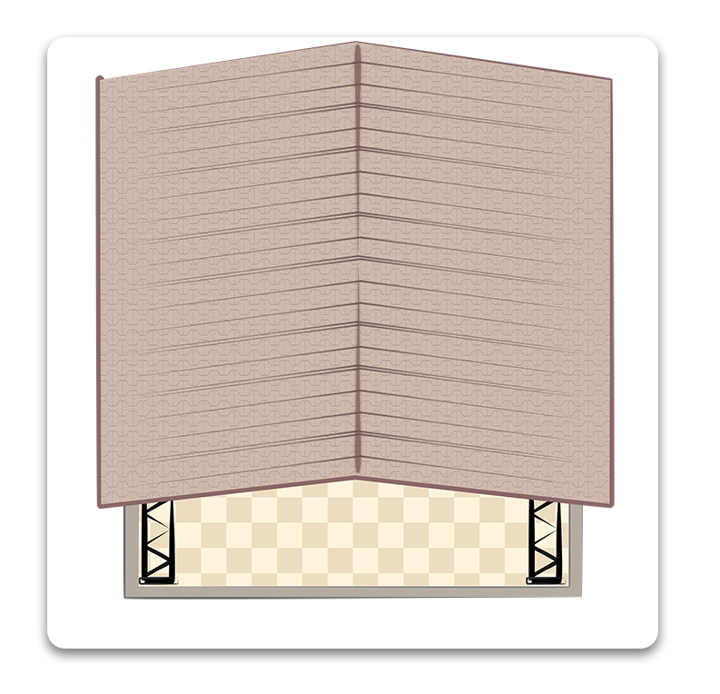
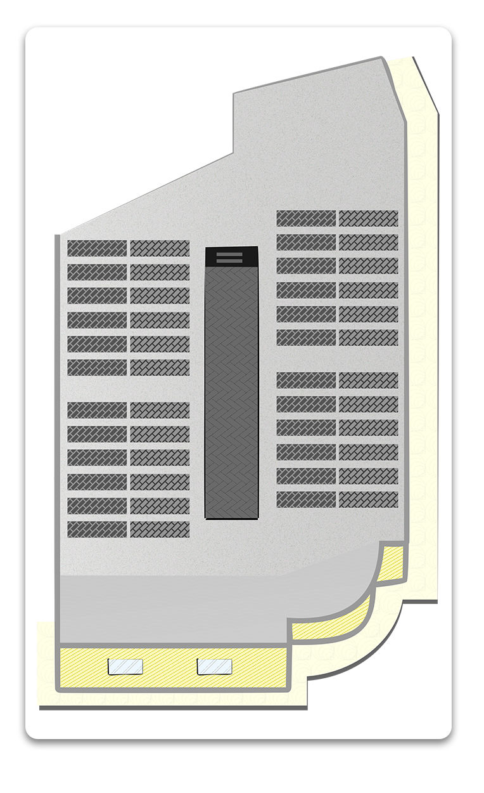
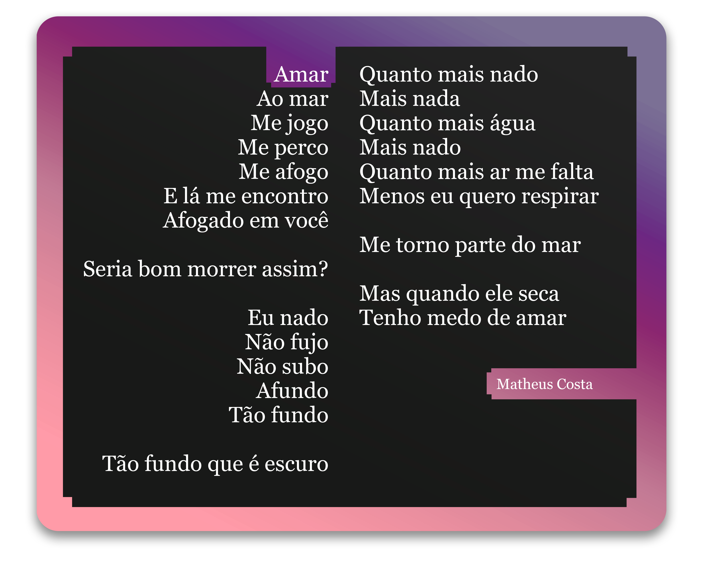

# **JOGOS**
  
## _**Dracul**_

#### Dracul é um jogo onde o vampirinho Dracul deve evitar a luz do sol e estacas para chegar ao próximo nível! Veja até onde consegue chegar nessa aventura!
 
## _**HybridChild (protótipo)**_

#### Protótipo do jogo HybridChild, incluindo as principais ideias do jogo final.
 
## _**HybridChild**_

#### HybridChild, o jogo em que você está dos dois lados! Escape dos obstaculos transitando entre dois lados de uma plataforma, e veja até onde consegue chegar nesse jogo minimalista!

  
# **ATIVIDADES RECENTES**
 
## _**Larissa e os Alimentos**_
### Larissa e Os Alimentos é um jogo desenvolvido em conjunto com a turma inteira de Jogos 3M, para a disciplina de Projeto Integrador.

#### Larissa e Os Alimentos, um jogo onde você aprende mais sobre alimentação saudável, vitaminas essenciais para o seu corpo e muito mais!
 
 
# **Artes**
 
## _**Larissa e Os Alimentos**_
Artes gráficas do jogo [Larissa e Os Alimentos](https://raixasantos.github.io/LARISSAEOSALIMENTOS).
 
### Prédio Anexo do IFCM

 
### Vivência do IFCM

 
### Prédio Principal

  

## **Concurso Adele de Oliveira 2018**
Poesia que levou a segunda colocação na categoria Ensino Médio, no prêmio Adele de Oliveira, em Ceará Mirim/RN.

  
Veja meus projetos no [GitHub](https://github.com/maathps/)