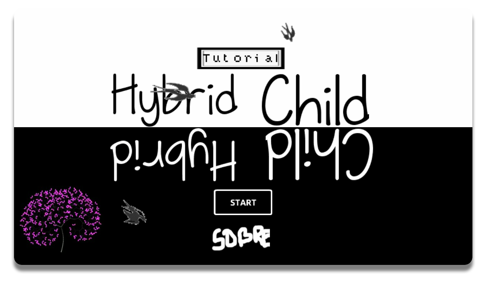
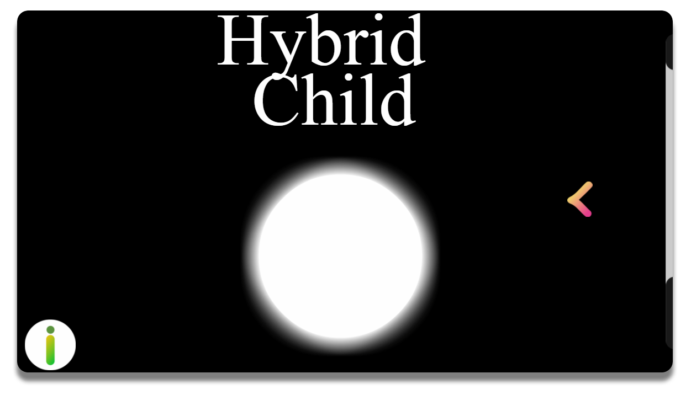

## Meu Portfolio

Matheus Costa, tenho 18 anos, um Twitter e 0 dinheiros.
Adoro pop, MPB, acho que hoje em dia tem muito filme de
terror sem sal mas não deixo de assistir nenhum.

#JOGOS
##Dracul
<a href="https://www.maathps.github.io/dracul" target="_blank">  </a>
###Dracul é um jogo onde o vampirinho Dracul deve evitar a luz do sol e estacas para chegar ao próximo nível! Veja até onde consegue chegar nessa aventura!

##HybridChild (protótipo)
<a href="https://www.maathps.github.io/hybidchild-prototype" target="_blank">  </a>
###Protótipo do jogo HybridChild, incluindo as principais ideias do jogo final.

##HybridChild
<a href="https://www.maathps.github.io/hybridchild" target="_blank">  </a>
###HybridChild, o jogo em que você está dos dois lados! Escape dos obstaculos transitando entre dois lados de uma plataforma, e veja até onde consegue chegar nesse jogo minimalista!

# Contatos
- Twitter
- Instagram
- Facebook

1. Email
2. Linkedin
3. Lattes

## Jogos

*Dracul*
_Underwater_
`HybridChild`

### Artes
1. Só link
[nyan cat](https://www.dailydot.com/wp-content/uploads/ca4/63/e6b345906552524c733901c654f9e966.jpg)

2. Imagem da internet


3. Imagem do repositório


4. Imagem que é link
[](maathps.github.io/dracul)

5. Imagem que é link avançado e que abre em uma nova guia
<a href="https://www.instagram.com/" target="_blank">  </a>

[MATHEUSCOSTAFOTOS](https://www.instagram.com/matheuscostafotos)

### Markdown

Markdown is a lightweight and easy-to-use syntax for styling your writing. It includes conventions for

```markdown
Syntax highlighted code block

# Header 1
## Header 2
### Header 3

- Bulleted
- List

1. Numbered
2. List

**Bold** and _Italic_ and `Code` text

[Link](url) and 
```

For more details see [GitHub Flavored Markdown](https://guides.github.com/features/mastering-markdown/).

### Jekyll Themes

Your Pages site will use the layout and styles from the Jekyll theme you have selected in your [repository settings](https://github.com/maathps/maathps.github.io/settings). The name of this theme is saved in the Jekyll `_config.yml` configuration file.

### Support or Contact

Having trouble with Pages? Check out our [documentation](https://help.github.com/categories/github-pages-basics/) or [contact support](https://github.com/contact) and we’ll help you sort it out.
