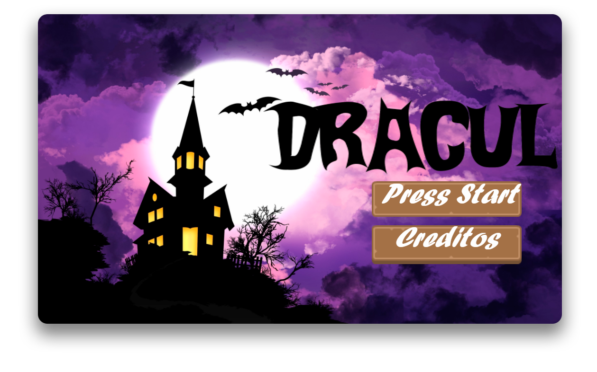

# **JOGOS**
## _**Dracul**_

#### Dracul é um jogo onde o vampirinho Dracul deve evitar a luz do sol e estacas para chegar ao próximo nível! Veja até onde consegue chegar nessa aventura!

## _**HybridChild (protótipo)**_

#### Protótipo do jogo HybridChild, incluindo as principais ideias do jogo final.

## _**HybridChild**_

#### HybridChild, o jogo em que você está dos dois lados! Escape dos obstaculos transitando entre dois lados de uma plataforma, e veja até onde consegue chegar nesse jogo minimalista!

# **ATIVIDADES RECENTES**
## _**Larissa e os Alimentos**_
### Larissa e Os Alimentos é um jogo desenvolvido em conjunto com a turma inteira de Jogos 3M, para a disciplina de Projeto Integrador.

#### Larissa e Os Alimentos, um jogo onde você aprende mais sobre alimentação saudável, vitaminas essenciais para o seu corpo e muito mais!