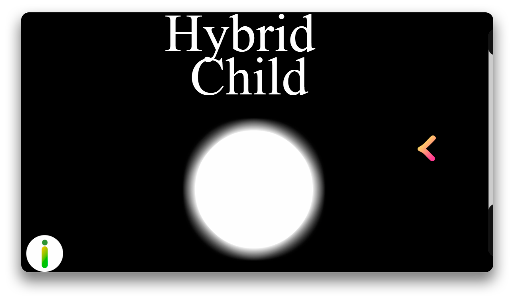

# **JOGOS**
  
##
_**Dracul**_

####
Dracul é um jogo onde o vampirinho Dracul deve evitar a luz do sol e estacas para chegar ao próximo nível! Veja até onde consegue chegar nessa aventura!

 
##
_**HybridChild (protótipo)**_

####
Protótipo do jogo HybridChild, incluindo as principais ideias do jogo final.

 
##
_**HybridChild**_

####
HybridChild, o jogo em que você está dos dois lados! Escape dos obstaculos transitando entre dois lados de uma plataforma, e veja até onde consegue chegar nesse jogo minimalista!

  
# **ATIVIDADES RECENTES**
 
##
_**Larissa e os Alimentos**_

###
Larissa e Os Alimentos é um jogo desenvolvido em conjunto com a turma inteira de Jogos 3M, para a disciplina de Projeto Integrador.

####
Larissa e Os Alimentos, um jogo onde você aprende mais sobre alimentação saudável, vitaminas essenciais para o seu corpo e muito mais!

 
